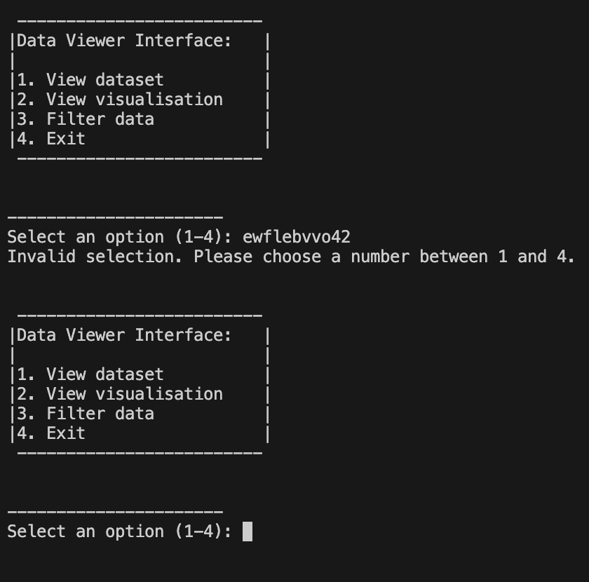
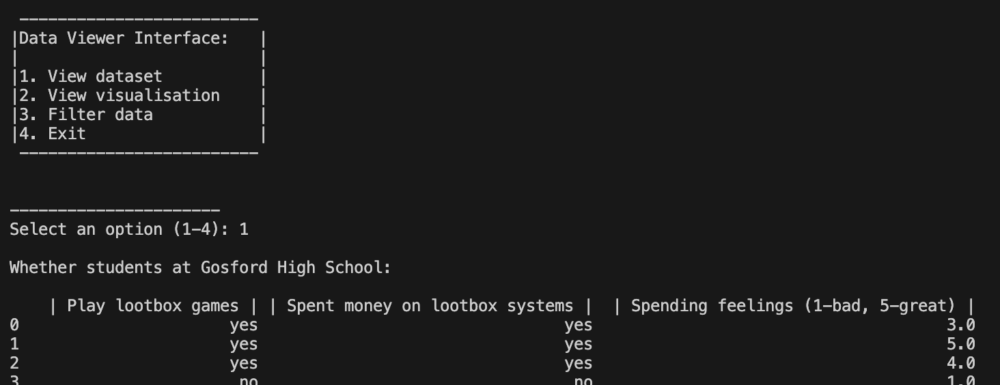
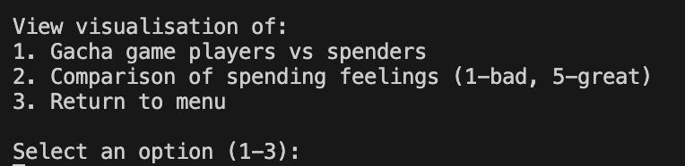
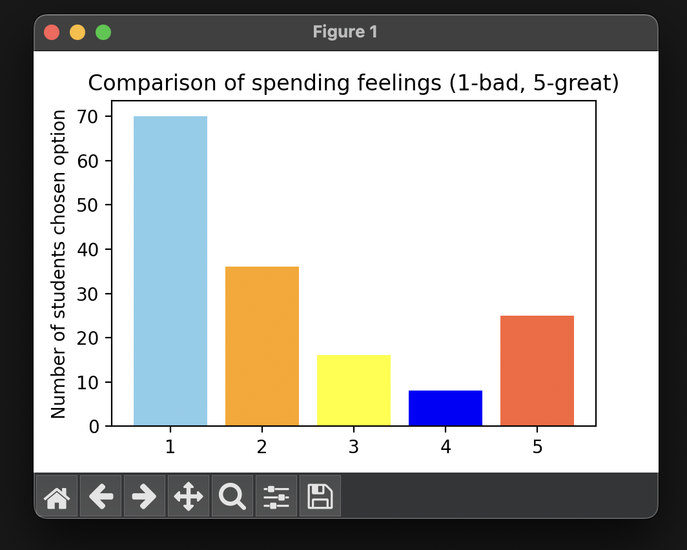
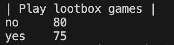

# **README**

### **PURPOSE:**  
The purpose of this project is to examine whether there is a link between adolescents' engagement with lootbox games and the development of future gambling behaviours. By transforming raw data collected from students at Gosford High into valuable insights, I aim to explore the impact of these video games on younger, more impressionable audiences.

https://forms.gle/n8GHvjxE7aqjcFCb6 <-- link of lootbox games form sent to students

### **USAGE GUIDE:** 

To interact with the text based program, the user must enter numbers through the terminal. Anything besides the displayed options prints an error message.

**INCORRECT:**

↑ Typing in **invalid options** will print an error message, and the question will be asked again

**CORRECT:**

↑ Typing in **valid options** as displayed will proceed the code

-------
### **VISUALISATION WINDOWS**

When the user selects any of the options within in "View visualisation" category, a new window will open up. 

While the visualisation is open, the user can still interact with the main menu. However, if a new visualisation is selected, it will **replace** the old window. 

----
### **FEATURES**  
1. **Viewing cleaned dataset** <-- Where invalid data is removed for accuracy and reliability (option 1)  
"Play lootbox games"  
"Spent money on lootbox systems"  
"Spending feelings (1-bad, 5-great)"

2. **View visualisation** <-- Bar charts  
"Gacha game players vs spenders"  
"Comparison of spending feelings (1-bad, 5-great)"

3. **Filter data**  
Displays:
"Play lootbox games"  
"Spent money on lootbox systems"  
"Spending feelings" (1-bad, 5-great) 
**SEPERATELY**

    
↑ At the bottom of the dataset, it will include the total amount of people who chose each option

4. **Exit + Return to Menu**
--------