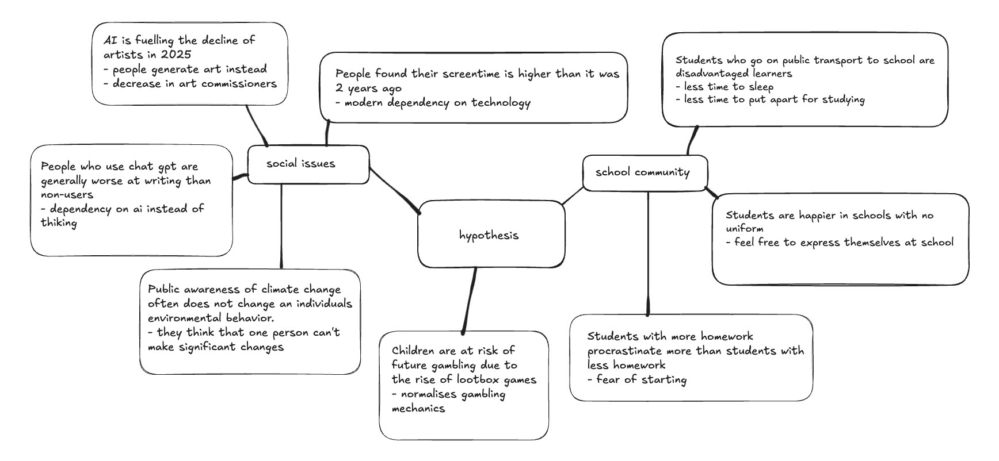

# **Assessment Task 3**
## Phase 1: Identifying and defining
### **Mind map:**

### **Define your purpose:**
"Gosford High students are at risk of future gambling habits due to lootbox games"
### **Requirements outline**
**Functional requirements:**  

**Data loading:**  
The system should be able to import CSV files and .png images. It must notify the user when errors such as incorrect formatting or missing files. 

**Data cleaning:**  
The system needs to remove rows with NA and double values such as "yes, no". Unnecessary colums must be removed when the data is printed.
Additionally, it should also allow users to filter through groups of data based on the questions asked in the local survey. 

**Data analysis:**  
The interface should be clean, consistent, and visually appealing (chart colours). Through the data filtering menu, the number of people who chose each option will be counted and displayed.

eg. 
"Whether students play lootbox games"
yes -> 75
no -> 80

**Data visualisation:**  
The system should include data visualisation tools such as tables and bar graphs using Pandas and Matplotlib to help users compare data and identify patterns easily. All visualisations must include clear titles, axis labels and visually sppealing colours.

**Data reporting:**
The system should display the cleaned and filtered datasets directly in the terminal, while visual representations are automatically opened in a new window.

### **Non-functional requirements**

**Usability:**  
The user interface will allow users to view data and apply data filters by selecting presented options and subtitles. The README file will define the purpose of the interface, include a usage guide, and list all features.  

**Reliability:**
To maintain data reliabilty and integrity, the rows with missing values (NA) or contradictory answers (e. "yes", "no") are removed, ensuring that only valid data ia analysed and used in the dataset. The displayed results should match the cleaned dataset without bias or error.

### **Use case:**  

**Actor:** User  

**Goal:**  To access and interact with existing data through the program's user interface.  

**Preconditions:**  
- The data has been preloaded into the system by an administrator/ programmer
- The user has access to the system interface  

**Main flow:**
1. User opens the program and is presented with the text based menu
2. The user selects one of the following options:  
a. View dataset  
b. View visualisation  
c. Filter data  
d. Exit

3. The system performs the requested action and outputs to the user

**Postconditions:**
- user has viewed/interacted with the data
- data remains available

## Phase 2: Researching and Planning
**Hypothesis: Gosford High students are at risk of future gambling habits due to lootbox games**

### **Research your chosen issue- SEEI**  

Lootboxes in video games have become increasingly controversial due to their structural and psychological similarities to traditional gambling mechanics, particularly in how they normalise gambling behaviour among adolecsents.
By using in game currency or even real money for a chance at a desirable item, lootboxes blur the line between gaming and gambling. Players are exposed to concepts like risk, chance and *variable ratio enforcement* - the same reward used in slot machines- without realising they may be developing unhealthy, addictive behaviours. These mechanics are often paired with bright visuals and exciting sounds, making the system seem fun and harmless instead of potentially harmful.

For example, a teenager who regularly engages with lootbox games may become desensitised to spending money on chance-based systems, reducing the perceived danger of actual gambling and increasing his likelihood of engaging in it later in life.

As lootboxes become more common in video games, it is crucial to recognise the damaging impact of these systems and protect vulnerable communities from being exploited under the guise of play.

- In a recent study, a survery of 1000 individuals,  20% self reported that their first exposure to gambling-like behaviours came through lootbox components in video games, often during adolescence.

- Median monthly expenditure on lootbox mechanics was $50/month for adolescents, increasing to $72 for young adults.

- According to the NSW Responsible gambling fund:

    *"Both adolescents and young adults who had either opened, bought or sold
loot boxes within the last 12 months were also more likely to have: 1- gambled
in the last 12 months (young adults), 2- gambled more frequently (young
adults), 3- spent more money gambling (young adults), 4- suffered more
gambling problems (adolescents and young adults), 5- suffered more
gambling-related harm (young adults), and 6- endorsed more positive
attitudes towards gambling (adolescents and young adults)."* 

****
*variable ratio enforcement:*   
When a win is given after an unpreditable amount of attempts.   
For example, a player keeps opening lootboxes in hopes to get a rare item. Because the reward could come at any time, they are compelled to keep spending.

***LINKS***  
https://forms.gle/n8GHvjxE7aqjcFCb6 <-- link of lootbox games form sent to students 

https://acquire.cqu.edu.au/articles/report/Loot_Boxes_Are_they_grooming_youth_for_gambling_/13405073

https://www.lifeworksnw.org/2025/02/27/loot-box-games-and-problem-gambling/

https://pubmed.ncbi.nlm.nih.gov/35397261/

### **Data dictionary**
| FIELD | DATATYPE | FORMAT FOR DISPLAY | DESCRIPTION | EXAMPLE | VALIDATION
|---|---|---|---|---|---|
| Lootbox_players| object | XX...XX| Whether students play lootbox games (yes/no)| yes | Can only be yes or no|
| Lootbox_spenders| object | XX...XX | Whether students have spent money on lootbox systems in games (yes/no)| no| Can only be yes or no|
| Potential_spenders| float64| N | How students feel about spending money on lootbox systems in games|3| Can only be 1-5, 1 as in not good at all, 5 as in great

## Phase 3: Producing and Implementing
(In main.py, data.csv, data_module.py)

## Phase 4: Testing and evaluating

### **Analyse and conclude**

### **Peer verification**  
**ARISA**:  

| PLUS | MINUS |
|---|---|
|- The use of time.sleep makes the program feel more structured and controlled|  |
|- Visually appealing | - The aesthetics are not consistent |
|- Easy to navigate and there is an exit/back in each set of options|
|- When I type a number that is not a valid, it reprints the options and an error message | - When I type a word instead of a number, the program crashes (error) 
|- Dataset is clean and accurate | - Can't search for data (but can filter)|
|- README is easy to follow with visuals | 
 
 
**IMPLICATION**

While Vanessa's project is overall structured, clear and accessible with several positive aspects, it may need to undergo slight changes to create a more cohesive program. To enhance reliabilty and user experience, input handling should be fixed to prevent crashes from unexpected entries (letters specifically) and the interface could use more consistency. Introducing search functions alongside filtering would also significantly improve how users are able to draw valuable insight from the data analysed and visualised.

**Evaluate your project**
